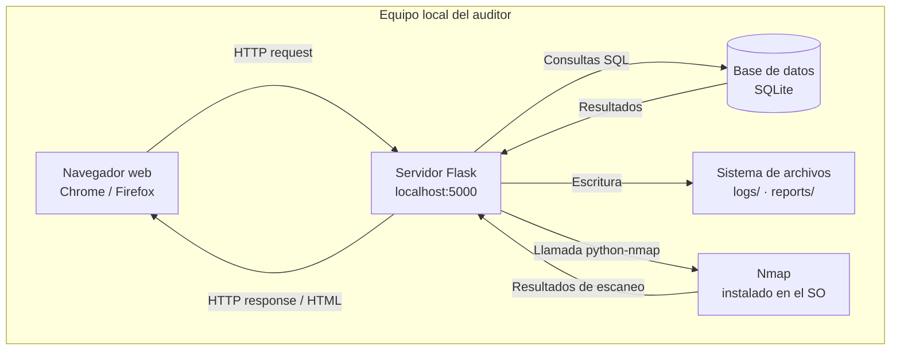
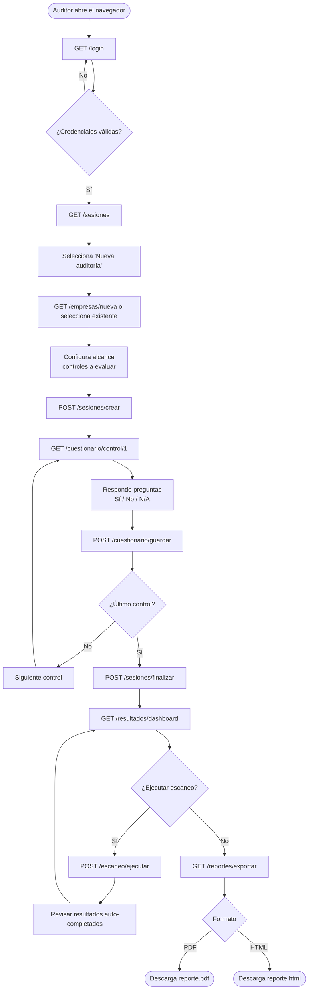

# SecureAudit MX — Documento de Arquitectura

| Campo | Valor |
|---|---|
| **Versión** | 1.0.0 |
| **Fecha** | 2026-06-05 |
| **Autor** | Roberto Pérez |
| **Estado** | En desarrollo |

---

## Tabla de contenido

- [1. Stack tecnológico y justificación](#1-stack-tecnológico-y-justificación)
- [2. Diagrama de arquitectura del sistema](#2-diagrama-de-arquitectura-del-sistema)
- [3. Estructura de carpetas del proyecto](#3-estructura-de-carpetas-del-proyecto)
- [4. Flujo principal del usuario](#4-flujo-principal-del-usuario)
- [5. Decisiones de diseño](#5-decisiones-de-diseño)

---

## 1. Stack tecnológico y justificación

SecureAudit MX es una aplicación web local de una sola instancia. Las tecnologías fueron elegidas para maximizar portabilidad, minimizar dependencias de instalación y ser apropiadas para el contexto PyME, donde no existe infraestructura de servidor especializada.

| Capa | Tecnología | Alternativas consideradas | Justificación |
|---|---|---|---|
| Lenguaje | Python 3.10+ | — | Requerimiento del proyecto. Ecosistema maduro para scripting de seguridad (Nmap, análisis de red). |
| Framework web | Flask 3.x | Django | Flask es minimalista y no impone estructura. Para una app de una sola instancia sin ORM complejo, Django añade complejidad innecesaria. Flask permite aprender la arquitectura desde cero. |
| Base de datos | SQLite 3 | PostgreSQL, MySQL | SQLite no requiere servidor ni configuración. Se crea automáticamente en el primer arranque. Suficiente para el volumen de datos esperado (< 500 sesiones, RNF-03.4). |
| Templates | Jinja2 | React, Vue | Jinja2 está integrado en Flask sin dependencias adicionales. Evita un stack frontend separado y mantiene toda la lógica en Python. |
| CSS / UI | Bootstrap 5 | Tailwind, CSS propio | Bootstrap 5 ofrece componentes responsivos listos para usar sin necesidad de compilador. Se sirve localmente (RNF-04.4). |
| Gráficas | Chart.js | D3.js, Plotly | Chart.js es ligero, bien documentado y suficiente para gráficas de radar y barras. Se sirve localmente. |
| Generación PDF | WeasyPrint | ReportLab, fpdf2 | WeasyPrint convierte HTML/CSS a PDF, lo que permite reutilizar los templates de Jinja2 sin duplicar la lógica de presentación. |
| Escaneo de red | python-nmap | scapy, socket nativo | python-nmap es un wrapper maduro sobre Nmap que simplifica el parsing de resultados y es ampliamente usado en herramientas de seguridad. |
| Hashing | bcrypt (flask-bcrypt) | hashlib SHA-256 | bcrypt es el estándar recomendado para contraseñas por su factor de costo ajustable (RNF-01.1). SHA-256 no es adecuado para contraseñas. |
| Autenticación | flask-login | JWT, sesiones manuales | flask-login gestiona el ciclo de vida de sesión de forma segura con mínimo código adicional. Adecuado para apps locales sin API REST. |

---

## 2. Diagrama de arquitectura del sistema

SecureAudit MX sigue una arquitectura de **tres capas** ejecutadas en el mismo equipo local. No existe comunicación con servicios externos durante la ejecución normal.



**Descripción de capas:**

- **Capa de presentación** — el navegador web renderiza las vistas HTML generadas por Jinja2. No ejecuta lógica de negocio; toda la validación ocurre en el servidor.
- **Capa de lógica** — Flask gestiona las rutas, autenticación, lógica de scoring, generación de reportes y coordinación con Nmap. Es el único punto de entrada al sistema.
- **Capa de datos** — SQLite persiste sesiones, respuestas, usuarios y logs. El archivo de base de datos reside en el directorio del proyecto y no es accesible desde fuera del equipo.

---

## 3. Estructura de carpetas del proyecto

```
secureaudit_mx/
│
├── app/                        # Código fuente de la aplicación
│   ├── __init__.py             # Factory de la app Flask (create_app)
│   ├── app.py                  # Punto de entrada: inicializa y corre el servidor
│   │
│   ├── models/                 # Modelos de base de datos (SQLAlchemy)
│   │   ├── usuario.py
│   │   ├── empresa.py
│   │   ├── sesion.py
│   │   ├── control.py
│   │   ├── pregunta.py
│   │   ├── respuesta.py
│   │   └── log.py
│   │
│   ├── routes/                 # Blueprints de Flask (un archivo por módulo)
│   │   ├── auth.py             # RF-01: login, logout, registro
│   │   ├── empresas.py         # RF-02: CRUD de empresas
│   │   ├── sesiones.py         # RF-03: gestión de sesiones de auditoría
│   │   ├── cuestionario.py     # RF-04: flujo del cuestionario
│   │   ├── resultados.py       # RF-05, RF-06: scoring y dashboard
│   │   ├── reportes.py         # RF-07: generación y exportación de reportes
│   │   ├── escaneo.py          # RF-08: módulo de escaneo de red
│   │   └── admin.py            # RF-09: log de actividad y gestión de usuarios
│   │
│   ├── services/               # Lógica de negocio desacoplada de las rutas
│   │   ├── scoring.py          # Algoritmo de cálculo de riesgo (RF-05)
│   │   ├── pdf_generator.py    # Generación de reportes con WeasyPrint (RF-07)
│   │   └── scanner.py          # Integración con python-nmap (RF-08)
│   │
│   ├── templates/              # Vistas HTML (Jinja2)
│   │   ├── base.html           # Layout base con navbar y estilos comunes
│   │   ├── auth/
│   │   ├── empresas/
│   │   ├── sesiones/
│   │   ├── cuestionario/
│   │   ├── resultados/
│   │   └── reportes/
│   │
│   └── static/                 # Archivos estáticos servidos localmente
│       ├── css/
│       ├── js/
│       │   ├── bootstrap.min.js
│       │   └── chart.min.js
│       └── img/
│
├── tests/                      # Pruebas automatizadas (RNF-05.2)
│   ├── test_scoring.py
│   ├── test_reportes.py
│   └── test_auth.py
│
├── docs/                       # Documentación del proyecto
│   ├── requerimientos.md
│   ├── arquitectura.md         # Este documento
│   ├── checklist_auditoria_v1.md
│   └── modelo_datos.md         # Pendiente — Semana 3
│
├── logs/                       # Logs de actividad (RF-09, gitignored)
│   └── auditoria.log
│
├── reports/                    # Reportes PDF generados (gitignored)
│
├── instance/                   # Configuración de instancia y base de datos
│   └── secureaudit.db          # SQLite (gitignored)
│
├── requirements.txt            # Dependencias Python (RNF-04.3)
├── .env.example                # Variables de entorno de ejemplo
├── .gitignore
└── README.md
```

> **Regla de diseño:** las rutas en `routes/` no deben contener lógica de negocio. Si un cálculo o proceso toma más de ~10 líneas, pertenece a `services/`. Esto facilita las pruebas unitarias y cumple con RNF-05.1.

---

## 4. Flujo principal del usuario

El diagrama siguiente representa el camino feliz completo: desde que el auditor abre la aplicación hasta que descarga el reporte PDF.



---

## 5. Decisiones de diseño

Las siguientes decisiones arquitectónicas tuvieron alternativas viables. Se documenta el contexto, la opción elegida y las consecuencias para facilitar futuras revisiones.

| ID | Decisión | Contexto | Alternativa rechazada | Consecuencia |
|---|---|---|---|---|
| ADR-01 | App local sin despliegue en nube | Los datos de auditoría son sensibles para las PyMES. Transmitirlos a un servidor externo requeriría cifrado, gestión de claves y política de privacidad. | Despliegue en Railway / Render | Los datos nunca salen del equipo del auditor. La herramienta no requiere internet en ejecución. Limitación: no hay acceso remoto ni colaboración en tiempo real. |
| ADR-02 | Jinja2 + Bootstrap en lugar de SPA | El público objetivo usa la herramienta de forma guiada y lineal, no como una aplicación interactiva compleja. Una SPA añadiría un build step y complejidad de mantenimiento. | React + API REST | El servidor Flask gestiona tanto la lógica como la presentación. Menos código, menos dependencias, más fácil de auditar. Limitación: actualizaciones de UI requieren recarga de página completa. |
| ADR-03 | Un archivo SQLite, sin migraciones complejas | La herramienta es de un solo usuario por instancia. No hay concurrencia de escritura que justifique un motor de base de datos con servidor. | PostgreSQL + SQLAlchemy | Instalación con `pip install -r requirements.txt` sin pasos adicionales. Limitación: SQLite no escala a múltiples usuarios simultáneos (fuera del alcance en v1.0.0). |
| ADR-04 | WeasyPrint para PDF desde HTML | Los templates Jinja2 ya definen la estructura del reporte. Convertir HTML a PDF reutiliza ese trabajo sin duplicar la lógica de presentación. | ReportLab (PDF programático) | El diseño del reporte se controla con CSS estándar. Limitación: WeasyPrint requiere dependencias del sistema (libpango) que deben documentarse en el README. |
| ADR-05 | `services/` como capa intermedia | El algoritmo de scoring (RF-05) y la generación de PDF (RF-07) son lo suficientemente complejos para merecer pruebas unitarias independientes de las rutas HTTP. | Lógica directamente en `routes/` | Las pruebas en `tests/` pueden importar `services/scoring.py` sin necesidad de levantar el servidor Flask. Cumple RNF-05.2. |

---

*Documento generado como parte del portafolio académico y profesional — Ingeniería en Software, Universidad Tecnológica de Ciudad Juárez.*
