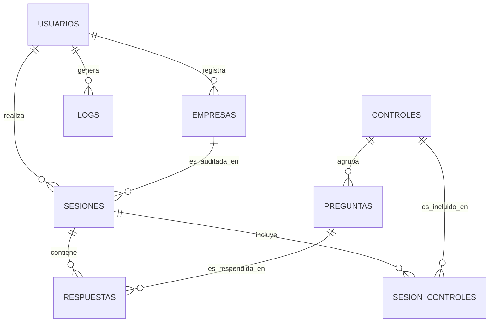

# SecureAudit MX — Modelo de Datos

| Campo | Valor |
|---|---|
| **Versión** | 1.0.0 |
| **Fecha** | 2026-06-11 |
| **Autor** | Roberto Pérez |
| **Estado** | En desarrollo |

---

## Tabla de contenido

- [1. Diagrama Entidad-Relación](#1-diagrama-entidad-relación)
- [2. Diccionario de datos](#2-diccionario-de-datos)
- [3. Relaciones y reglas de integridad](#3-relaciones-y-reglas-de-integridad)
- [4. Decisiones de diseño](#4-decisiones-de-diseño)
- [5. Casos especiales](#5-casos-especiales)

---

## 1. Diagrama Entidad-Relación

El esquema cuenta con **8 tablas**: 6 entidades principales (`usuarios`, `empresas`, `sesiones`, `controles`, `preguntas`, `logs`) y 2 tablas puente para relaciones muchos a muchos (`respuestas`, `sesion_controles`).

---

## 2. Diccionario de datos

### 2.1 `usuarios` (RF-01)

| Columna | Tipo | Restricciones | Descripción |
|---|---|---|---|
| id_usuario | INTEGER | PK, AUTOINCREMENT | Identificador único del usuario |
| rol_usuario | TEXT | NOT NULL, CHECK IN ('auditor','tecnico','directivo') | Rol del usuario (RF-01.4): U01, U02, U03 |
| nombre_usuario | TEXT | NOT NULL | Nombre(s) |
| apellidoP_usuario | TEXT | NOT NULL | Apellido paterno |
| apellidoM_usuario | TEXT | NULLABLE | Apellido materno |
| correo_usuario | TEXT | NOT NULL, UNIQUE | Correo electrónico (usado para login) |
| contraseña_usuario | TEXT | NOT NULL | Hash bcrypt de la contraseña |
| es_activo | BOOLEAN | NOT NULL, DEFAULT 1 | Permite deshabilitar cuentas sin eliminarlas |
| intentos_fallidos | INTEGER | NOT NULL, DEFAULT 0 | Contador para RF-01.7 (rate limiting) |
| bloqueado_hasta | DATETIME | NULLABLE | Fecha/hora hasta la cual la cuenta está bloqueada (RF-01.7) |
| fecha_creacion | DATETIME | NOT NULL, DEFAULT CURRENT_TIMESTAMP | Auditoría interna del registro |

### 2.2 `empresas` (RF-02)

| Columna | Tipo | Restricciones | Descripción |
|---|---|---|---|
| id_empresa | INTEGER | PK, AUTOINCREMENT | Identificador único de la empresa |
| nombre_empresa | TEXT | NOT NULL | Razón social o nombre comercial |
| sector_empresa | TEXT | NULLABLE | Giro/sector de la PyME |
| tamaño_empresa | TEXT | NULLABLE, CHECK IN ('micro','pequeña','mediana') | Clasificación por tamaño |
| nombre_contacto_empresa | TEXT | NULLABLE | Persona de contacto |
| id_usuario_registro | INTEGER | FK → usuarios.id_usuario, NOT NULL | Usuario que dio de alta la empresa |
| fecha_registro | DATETIME | NOT NULL, DEFAULT CURRENT_TIMESTAMP | Fecha de alta |

> Nota: el campo `sesion_activa` propuesto en el borrador se elimina — es un dato derivado (ver sección 4, D-03).

### 2.3 `sesiones` (RF-03)

| Columna | Tipo | Restricciones | Descripción |
|---|---|---|---|
| id_sesion | INTEGER | PK, AUTOINCREMENT | Identificador único de la sesión de auditoría |
| id_empresa | INTEGER | FK → empresas.id_empresa, NOT NULL | Empresa auditada |
| id_usuario | INTEGER | FK → usuarios.id_usuario, NOT NULL | Usuario que ejecuta la auditoría |
| fecha_inicio | DATETIME | NOT NULL, DEFAULT CURRENT_TIMESTAMP | Fecha de inicio de la auditoría |
| fecha_fin | DATETIME | NULLABLE | Fecha de finalización (NULL mientras esté en progreso) |
| estado_sesion | TEXT | NOT NULL, CHECK IN ('en_progreso','pausada','finalizada'), DEFAULT 'en_progreso' | Estado de la sesión (RF-03.3: pausar/reanudar; RF-03.5: finalizada = inmutable) |

### 2.4 `controles` (CIS Controls v8)

| Columna | Tipo | Restricciones | Descripción |
|---|---|---|---|
| id_control | INTEGER | PK, AUTOINCREMENT | Identificador interno del control |
| numero_control | INTEGER | NOT NULL, UNIQUE | Número del control CIS (1–18) |
| nombre_control | TEXT | NOT NULL | Nombre del control (ej. "Inventario y Control de Activos de Hardware") |

### 2.5 `preguntas` (RF-04)

| Columna | Tipo | Restricciones | Descripción |
|---|---|---|---|
| id_pregunta | INTEGER | PK, AUTOINCREMENT | Identificador único de la pregunta |
| id_control | INTEGER | FK → controles.id_control, NOT NULL | Control al que pertenece |
| codigo_pregunta | TEXT | NOT NULL, UNIQUE | Código del checklist (ej. "1.1", "11.4") |
| texto_pregunta | TEXT | NOT NULL | Enunciado de la pregunta de auditoría |
| cia_pregunta | TEXT | NOT NULL | Combinación CIA aplicable (ej. "C, I, A") |
| criticidad_pregunta | TEXT | NOT NULL, CHECK IN ('Alta','Media','Baja') | Criticidad de la pregunta |
| tipo_respuesta | TEXT | NOT NULL, CHECK IN ('si_no_na','frecuencia'), DEFAULT 'si_no_na' | Tipo de respuesta esperada (ver sección 5) |
| descripcion_ayuda | TEXT | NULLABLE | Texto explicativo para el auditor sobre qué evalúa la pregunta (RNF-02.3) |

> Se agrega `codigo_pregunta` para vincular cada fila con su ID del checklist (`checklist_auditoria_v1.md`), y `tipo_respuesta` para diferenciar la pregunta 11.4 (ver sección 5).

### 2.6 `respuestas` (RF-04, RF-05)

| Columna | Tipo | Restricciones | Descripción |
|---|---|---|---|
| id_respuesta | INTEGER | PK, AUTOINCREMENT | Identificador único de la respuesta |
| id_sesion | INTEGER | FK → sesiones.id_sesion, NOT NULL | Sesión a la que pertenece |
| id_pregunta | INTEGER | FK → preguntas.id_pregunta, NOT NULL | Pregunta respondida |
| respuesta_valor | TEXT | NOT NULL, CHECK IN ('si','no','na','diario','semanal','mensual') | Valor de la respuesta |
| comentario_respuesta | TEXT | NULLABLE | Observaciones del auditor |
| auto_completada | BOOLEAN | NOT NULL, DEFAULT 0 | Indica si fue llenada automáticamente por el escaneo (RF-08.5) |
| fecha_actualizacion | DATETIME | NULLABLE | Última modificación manual del auditor (trazabilidad) |

Restricción adicional: `UNIQUE(id_sesion, id_pregunta)` — una sesión no puede tener dos respuestas para la misma pregunta.

### 2.7 `sesion_controles`

| Columna | Tipo | Restricciones | Descripción |
|---|---|---|---|
| id_sesion | INTEGER | FK → sesiones.id_sesion, PK compuesta | Sesión |
| id_control | INTEGER | FK → controles.id_control, PK compuesta | Control incluido en el alcance de la sesión |

Tabla puente para auditorías parciales (RF-03): define qué controles fueron seleccionados al configurar la sesión.

### 2.8 `logs` (RF-09)

| Columna | Tipo | Restricciones | Descripción |
|---|---|---|---|
| id_log | INTEGER | PK, AUTOINCREMENT | Identificador único del registro |
| id_usuario | INTEGER | FK → usuarios.id_usuario, NULLABLE | Usuario que generó la acción (NULL en intentos de login fallidos con correo inexistente) |
| fecha_log | DATETIME | NOT NULL, DEFAULT CURRENT_TIMESTAMP | Fecha y hora del evento (RF-09.2) |
| accion_log | TEXT | NOT NULL | Acción realizada (login, logout, crear_sesion, generar_reporte, ejecutar_escaneo, crud_usuario, etc.) |
| resultado_log | TEXT | NOT NULL, CHECK IN ('exito','fallo') | Resultado de la acción |
| detalle_log | TEXT | NULLABLE | Información adicional (sin datos sensibles, RF-09.4) |

---

## 3. Relaciones y reglas de integridad

| Relación | Cardinalidad | Regla |
|---|---|---|
| usuarios → empresas | 1:N | Un usuario puede registrar varias empresas |
| usuarios → sesiones | 1:N | Un usuario puede ejecutar varias sesiones de auditoría |
| usuarios → logs | 1:N | Un usuario genera múltiples entradas de log |
| empresas → sesiones | 1:N | Una empresa puede ser auditada en múltiples sesiones (a lo largo del tiempo) |
| sesiones ↔ preguntas (vía respuestas) | M:N | Cada sesión responde un subconjunto de preguntas |
| controles → preguntas | 1:N | Cada control agrupa varias preguntas del checklist |
| sesiones ↔ controles (vía sesion_controles) | M:N | Cada sesión define qué controles están en su alcance |

**Reglas de negocio reflejadas en el esquema:**

- Si `sesiones.estado_sesion = 'finalizada'`, la aplicación no debe permitir INSERT/UPDATE en `respuestas` para ese `id_sesion` (RF-03.5). Esto se valida a nivel de aplicación, no como constraint de base de datos.
- `sesion_controles` debe poblarse al crear la sesión (RF-03), antes de iniciar el cuestionario.

---

## 4. Decisiones de diseño

| ID | Decisión | Contexto | Alternativa rechazada | Consecuencia |
|---|---|---|---|---|
| D-01 | Tabla puente `sesion_controles` para representar controles seleccionados | RF-03 permite auditorías parciales (rol Técnico). Se necesita registrar qué controles aplican a cada sesión. | Campo JSON `controles_seleccionados` en `sesiones` (ej. `"[1,3,5,7]"`) | Permite consultas SQL directas (ej. JOIN para saber qué sesiones evaluaron el Control 8) sin parsear texto. Consistente con el patrón ya usado en `respuestas`. Cumple RNF-05 (mantenibilidad). |
| D-02 | `logs.id_usuario` es NULLABLE | RF-01.7 exige loguear intentos de login fallidos, incluyendo correos que no corresponden a ningún usuario registrado. | FK NOT NULL | Permite registrar intentos de acceso con credenciales inválidas sin violar la integridad referencial. La aplicación debe registrar el correo intentado en `detalle_log` cuando `id_usuario` sea NULL. |
| D-03 | Eliminar `empresas.sesion_activa` | El borrador inicial incluía este campo para saber si una empresa tiene una auditoría en curso. | Almacenar el estado como columna en `empresas` | Es un dato derivado de `sesiones.estado_sesion` ('en_progreso'). Almacenarlo de forma redundante introduce riesgo de desincronización. Se calcula con una consulta cuando se necesite. |
| D-04 | `preguntas.tipo_respuesta` para distinguir preguntas de frecuencia | La pregunta 11.4 ("¿Con qué frecuencia se realizan los backups?") no es Sí/No/N.A., sino una opción entre Diario/Semanal/Mensual. | Crear una tabla separada para preguntas de frecuencia | Mantiene una sola tabla `preguntas`/`respuestas` para todo el cuestionario. El campo `tipo_respuesta` indica al frontend qué controles de formulario renderizar (radio Sí/No/N.A. vs. select de frecuencia), y `respuesta_valor` admite ambos conjuntos de valores mediante el CHECK constraint. |
| D-05 | `empresas.id_usuario_registro` en lugar de `id_usuario` | El campo FK original no dejaba claro su propósito. | Nombre genérico `id_usuario` | Deja explícito que representa "quién registró la empresa", no un vínculo de propiedad exclusiva — varias sesiones de distintos usuarios pueden auditar la misma empresa. |

---

## 5. Casos especiales

### Pregunta 11.4 — Frecuencia de backups

A diferencia de las otras 70 preguntas del checklist (`checklist_auditoria_v1.md`), la pregunta 11.4 no se responde con Sí/No/N.A.:

> *"¿Con qué frecuencia se realizan los backups? (Diario/Semanal/Mensual)"*

**Tratamiento en el modelo:**

- En `preguntas`, la fila con `codigo_pregunta = '11.4'` tiene `tipo_respuesta = 'frecuencia'`.
- En `respuestas`, el campo `respuesta_valor` para esta pregunta toma uno de los valores `'diario'`, `'semanal'`, `'mensual'` (en lugar de `'si'`/`'no'`/`'na'`).
- El servicio de scoring (`services/scoring.py`, RF-05) debe contemplar este caso especial: la tabla de puntos de RF-05.2 (No+Alta=3, etc.) no aplica directamente. Se recomienda definir una regla equivalente, por ejemplo: `mensual` o sin backups = 3 puntos (igual que "No" en criticidad Alta), `semanal` = 1 punto, `diario` = 0 puntos. Esta regla debe documentarse en `requerimientos.md` (RF-05.2) cuando se implemente.

---

*Documento generado como parte del portafolio académico y profesional — Ingeniería en Software, Universidad Tecnológica de Ciudad Juárez.*
