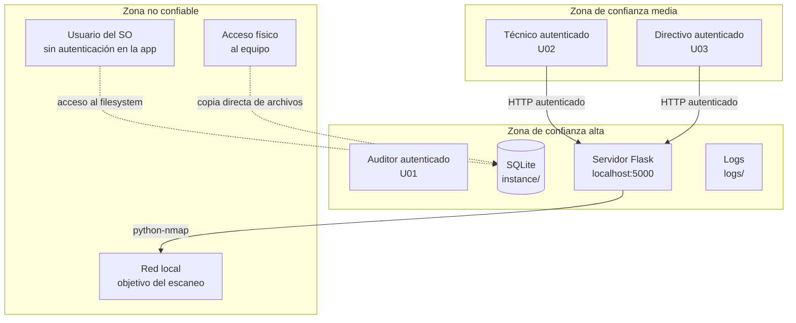

# SecureAudit MX — Modelo de Amenazas (STRIDE)

| Campo | Valor |
|---|---|
| **Versión** | 1.0.0 |
| **Fecha** | 2026-06-05 |
| **Autor** | Roberto Pérez |
| **Metodología** | STRIDE (Microsoft) |
| **Estado** | En desarrollo |

---

## Tabla de contenido

- [1. Activos del sistema](#1-activos-del-sistema)
- [2. Límite de confianza](#2-límite-de-confianza)
- [3. Análisis de amenazas STRIDE](#3-análisis-de-amenazas-stride)
- [4. Mitigaciones por amenaza](#4-mitigaciones-por-amenaza)
- [5. Riesgos residuales aceptados](#5-riesgos-residuales-aceptados)

---

## 1. Activos del sistema

Un activo es cualquier elemento del sistema cuya compromisión generaría un impacto relevante. Se ordenan por criticidad.

| ID | Activo | Descripción | Criticidad |
|---|---|---|:---:|
| A-01 | Credenciales de usuario | Correos y contraseñas almacenados en SQLite | Alta |
| A-02 | Datos de auditorías | Respuestas, hallazgos y scores por sesión | Alta |
| A-03 | Reportes generados | Archivos PDF/HTML con información sensible de la PyME auditada | Alta |
| A-04 | Log de actividad interna | Registro de acciones por usuario (RF-09) | Media |
| A-05 | Base de datos SQLite | Archivo `instance/secureaudit.db` — contiene todos los datos anteriores | Alta |
| A-06 | Módulo de escaneo de red | Capacidad de ejecutar Nmap contra una red objetivo | Alta |
| A-07 | Sesiones de usuario activas | Cookies de sesión Flask en el navegador | Media |

---

## 2. Límite de confianza

El límite de confianza (*trust boundary*) define qué actores y componentes son considerados confiables y cuáles no. SecureAudit MX opera completamente en un equipo local, lo que elimina amenazas de red externa pero introduce amenazas locales específicas.

**Supuesto de confianza fundamental:** el sistema operativo del equipo donde corre SecureAudit MX es confiable y está correctamente administrado. La aplicación no puede proteger los datos si el SO está comprometido.

---

## 3. Análisis de amenazas STRIDE

Para cada categoría STRIDE se identifican las amenazas específicas al contexto de SecureAudit MX.

### S — Spoofing (Suplantación de identidad)

| ID | Amenaza | Activo afectado | Probabilidad | Impacto |
|---|---|---|:---:|:---:|
| S-01 | Un atacante reutiliza credenciales filtradas de otro servicio para acceder como auditor | A-01, A-02 | Media | Alto |
| S-02 | Un usuario de la misma red local realiza un ataque de fuerza bruta al formulario de login | A-01 | Baja* | Alto |
| S-03 | Un usuario con sesión activa abandona el equipo sin cerrar sesión y otro usuario accede | A-07 | Media | Alto |

*Baja porque la app corre en localhost, no expuesta a internet.

### T — Tampering (Manipulación de datos)

| ID | Amenaza | Activo afectado | Probabilidad | Impacto |
|---|---|---|:---:|:---:|
| T-01 | Un usuario con acceso al sistema de archivos modifica directamente el archivo `secureaudit.db` para alterar resultados de una auditoría | A-05 | Media | Alto |
| T-02 | Un usuario con rol Técnico (U02) manipula parámetros HTTP para modificar respuestas de una sesión de otro auditor | A-02 | Baja | Alto |
| T-03 | Un usuario modifica el archivo de log `auditoria.log` para eliminar evidencia de sus acciones | A-04 | Baja | Medio |

### R — Repudiation (Repudio)

| ID | Amenaza | Activo afectado | Probabilidad | Impacto |
|---|---|---|:---:|:---:|
| R-01 | Un auditor niega haber generado o exportado un reporte con hallazgos específicos | A-03, A-04 | Baja | Medio |
| R-02 | Un usuario niega haber ejecutado el módulo de escaneo de red sobre una red no autorizada | A-06, A-04 | Baja | Alto |

### I — Information Disclosure (Divulgación de información)

| ID | Amenaza | Activo afectado | Probabilidad | Impacto |
|---|---|---|:---:|:---:|
| I-01 | Un error interno del servidor (500) expone un stack trace con rutas del sistema, versiones o estructura de la base de datos | A-05 | Media | Medio |
| I-02 | Un usuario con acceso físico al equipo copia el archivo `secureaudit.db` y extrae datos de auditorías en texto plano | A-05, A-02 | Media | Alto |
| I-03 | Los reportes PDF en la carpeta `reports/` son accesibles para cualquier usuario del SO sin autenticación | A-03 | Media | Alto |
| I-04 | Las cookies de sesión son transmitidas sin flag `HttpOnly` o `Secure` y pueden ser leídas por scripts en la página | A-07 | Baja | Medio |

### D — Denial of Service (Denegación de servicio)

| ID | Amenaza | Activo afectado | Probabilidad | Impacto |
|---|---|---|:---:|:---:|
| D-01 | Un usuario genera múltiples reportes PDF simultáneamente saturando la memoria del equipo | A-03 | Baja | Medio |
| D-02 | Un escaneo de red con rango CIDR muy amplio (e.g., `10.0.0.0/8`) bloquea el servidor Flask durante un tiempo prolongado | A-06 | Media | Medio |
| D-03 | La base de datos SQLite crece sin límite hasta agotar el espacio en disco | A-05 | Baja | Alto |

### E — Elevation of Privilege (Escalada de privilegios)

| ID | Amenaza | Activo afectado | Probabilidad | Impacto |
|---|---|---|:---:|:---:|
| E-01 | Un usuario con rol Técnico (U02) accede a rutas de administración manipulando la URL directamente | A-02, A-04 | Media | Alto |
| E-02 | Un usuario con rol Directivo (U03) accede a funciones de edición manipulando parámetros POST | A-02 | Baja | Medio |
| E-03 | Inyección SQL en un campo de formulario permite ejecutar operaciones no autorizadas sobre la base de datos | A-05 | Baja* | Alto |

*Baja si se usa el ORM de SQLAlchemy correctamente con consultas parametrizadas.

---

## 4. Mitigaciones por amenaza

| ID Amenaza | Mitigación | RF / RNF relacionado |
|---|---|---|
| S-01 | Implementar límite de intentos de login fallidos (máx. 5 intentos, bloqueo temporal de 15 min) | RNF-01 |
| S-02 | Misma mitigación que S-01. Adicionalmente, el servidor Flask solo escucha en `127.0.0.1`, no en `0.0.0.0` | RNF-01, ADR-01 |
| S-03 | Expiración automática de sesión tras 60 minutos de inactividad | RNF-01.5 |
| T-01 | Riesgo residual aceptado (ver sección 5). Documentar en el README que el archivo `.db` debe protegerse a nivel de permisos del SO | — |
| T-02 | Validar en el servidor que el `sesion_id` de cada request pertenece al usuario autenticado antes de cualquier operación de escritura | RNF-01.3 |
| T-03 | Riesgo residual aceptado (ver sección 5). El log no es la única fuente de verdad — la base de datos también registra timestamps | RF-09 |
| R-01 | El log registra cada exportación con timestamp y usuario (RF-09.1) | RF-09 |
| R-02 | El módulo de escaneo requiere confirmación explícita que se registra en el log con timestamp y usuario | RF-08.1, RF-09.1 |
| I-01 | En producción, desactivar el modo debug de Flask. Implementar página de error 500 personalizada que no exponga detalles internos | RNF-02.4, RNF-06.4 |
| I-02 | Riesgo residual aceptado (ver sección 5). Documentar en el README la recomendación de cifrar el disco o la carpeta del proyecto | — |
| I-03 | La carpeta `reports/` debe estar fuera del directorio `static/` para que Flask no la sirva como archivo estático. Los reportes solo deben descargarse a través de rutas autenticadas | RF-07.3 |
| I-04 | Configurar las cookies de sesión con flags `HttpOnly=True` y `SameSite=Lax` en la configuración de Flask | RNF-01 |
| D-01 | Limitar la generación de reportes a una operación concurrente por sesión de usuario | RF-07 |
| D-02 | Ejecutar el escaneo de red en un proceso separado con timeout configurable (máx. 5 minutos) | RF-08 |
| D-03 | Implementar limpieza periódica de reportes PDF con más de 90 días de antigüedad | RNF-03.4 |
| E-01 | Implementar decoradores de autorización por rol en cada ruta (`@rol_requerido`), no solo autenticación | RF-01.4, RNF-01 |
| E-02 | Misma mitigación que E-01. El rol Directivo (U03) solo puede acceder a rutas GET de consulta y exportación | RF-01.4 |
| E-03 | Usar exclusivamente el ORM SQLAlchemy con consultas parametrizadas. Prohibir construcción manual de strings SQL | RNF-01.3 |

---

## 5. Riesgos residuales aceptados

Los siguientes riesgos fueron identificados pero se aceptan conscientemente en la versión 1.0.0, ya sea porque su mitigación está fuera del alcance del proyecto o porque requieren controles a nivel del sistema operativo que la aplicación no puede imponer.

| ID | Riesgo | Justificación de aceptación | Recomendación al usuario |
|---|---|---|---|
| RA-01 | Acceso directo al archivo `secureaudit.db` (T-01, I-02) | La aplicación no puede cifrar el archivo de base de datos sin impactar la portabilidad. SQLite no ofrece cifrado nativo. | Almacenar el proyecto en una carpeta con permisos restringidos al usuario auditor. Considerar cifrado de disco completo (BitLocker, FileVault) en equipos con datos sensibles. |
| RA-02 | Modificación del log de actividad (T-03) | Implementar un log inmutable requiere infraestructura externa (servidor de logs, blockchain) incompatible con la arquitectura local (ADR-01). | El log es un control de disuasión, no de prevención. Para auditorías de alta sensibilidad, complementar con respaldos externos del log. |
| RA-03 | Compromiso del sistema operativo | Si el SO está comprometido, ninguna medida a nivel de aplicación es suficiente. Está fuera del alcance de SecureAudit MX. | Mantener el SO actualizado, usar antivirus y no instalar la herramienta en equipos de uso compartido no administrado. |
| RA-04 | Ausencia de cifrado en tránsito (HTTP local) | La comunicación entre navegador y Flask ocurre en `localhost` sin HTTPS. Configurar TLS para localhost añade complejidad de certificados autofirmados sin un beneficio real en este modelo de amenaza. | El riesgo es aceptable mientras la aplicación permanezca en localhost y no se exponga a la red local. No exponer el puerto 5000 fuera de `127.0.0.1`. |

---

*Documento generado como parte del portafolio académico y profesional — Ingeniería en Software, Universidad Tecnológica de Ciudad Juárez.*
